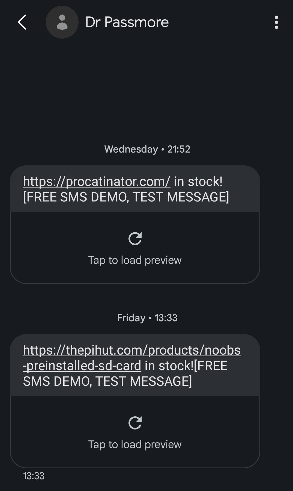

<!-- PROJECT LOGO -->
<br />
<div align="center">
  <a href="https://github.com/Dr-Passmore/Check-for-change">
    
  </a>

  <h3 align="center">Check for change - Raspberry Pi</h3>

  <p align="center">
    Stock detector to enable the opportunity to purchase a Raspberry Pi 4 or Pi Zero 2
    <br />
    <a href="https://github.com/Dr-Passmore/Check-for-change"><strong>Explore the Code »</strong></a>
    <br />
    <br />
    <a href="https://github.com/Dr-Passmore/Check-for-change/issues">Report Bug</a>
    ·
    <a href="https://github.com/Dr-Passmore/Check-for-change/issues">Request Feature</a>
  </p>
</div>


<!-- TABLE OF CONTENTS -->
<details>
  <summary>Table of Contents</summary>
  <ol>
    <li>
      <a href="#about-the-project">About The Project</a>
      <ul>
        <li><a href="#built-with">Built With</a></li>
      </ul>
    </li>
    <li>
      <a href="#getting-started">Getting Started</a>
      <ul>
        <li><a href="#prerequisites">Prerequisites</a></li>
        <li><a href="#installation">Installation</a></li>
      </ul>
    </li>
    <li><a href="#usage">Usage</a></li>
    <li><a href="#roadmap">Roadmap</a></li>
    <li><a href="#contributing">Contributing</a></li>
    <li><a href="#license">License</a></li>
    <li><a href="#contact">Contact</a></li>
    <li><a href="#acknowledgments">Acknowledgments</a></li>
  </ol>
</details>


<!-- ABOUT THE PROJECT -->
## About The Project

<div align="center">
  <a href="https://github.com/Dr-Passmore/Check-for-change">
    
  </a>
</div>

Due to the ongoing chip shortage, getting hold of a Raspberry Pi from an official supplier has been next to impossible. I was fortunate to pick up Raspberry Pi 4 from thepihut.com, as they very briefly had some in stock recently.

To make sure I had the opportunity to pick up a Raspberry Pi 4 or Pi Zero 2 when they next go into stock, I started this quick project. The check for change is a simple project that takes the visable text of the webpage and compares to the previous version, if a change has taken place and the item is in stock then the python script notifies via text message.

Key goals of this project:
* Only notifies if the product is in stock
* Send a text message alert
* To be run regularly on a Raspberry Pi

<p align="right">(<a href="#readme-top">back to top</a>)</p>


### Built With

This project has been built with Requests to get a copy of the webpage and Beautiful Soup to get the visible text. When a targeted item is in stock the Vonage Communications API is used to send text messages to alert that an item is in stock. 

* [Vonage API](https://www.vonage.co.uk/communications-apis/) 
* [Beautiful Soup](https://www.crummy.com/software/BeautifulSoup/bs4/doc/#)
* [Requests](https://requests.readthedocs.io/en/latest/)


<p align="right">(<a href="#readme-top">back to top</a>)</p>


<!-- GETTING STARTED -->
## Getting Started

To get set up, I have cloned the repo onto a Raspberry Pi, and added as Cron job to run checkforchange.sh. 

The Cron job is set to run every 30 minutes with: __*/30 * * * *__ 

You will need to create an account with [Vonage](https://www.vonage.co.uk/communications-apis/) and set up the communication API. You will need the secret and key for the API. Vonage has been selected as they provide €2 free credit, without a payment method required, and each text costs €0.04. 

Once the repo is cloned onto the Raspberry Pi you will need to manually run the main.py script, which will on first run ask for the API information and phone number. This information will be added to the newly created config.ini file. If any details need to be updated in future, you can edit them in the config.ini file.  

[Vonage API]
key = 
secret = 
countrycode = 
phonenumber = 

### Prerequisites

Install the required packages using:

__pip install -r requirements.txt__

The provided requirements will install the following:

* vonage>=2.0.0
* configparser>=5.0.2
* beautifulsoup4>=4.9.0
* requests>=2.25.0


### Installation

_Below is an example of how you can instruct your audience on installing and setting up your app. This template doesn't rely on any external dependencies or services._

1. Get a free API Key at [https://example.com](https://example.com)
2. Clone the repo
   ```sh
   git clone https://github.com/your_username_/Project-Name.git
   ```
3. Install NPM packages
   ```sh
   npm install
   ```
4. Enter your API in `config.js`
   ```js
   const API_KEY = 'ENTER YOUR API';
   ```

<p align="right">(<a href="#readme-top">back to top</a>)</p>


<!-- USAGE EXAMPLES -->
## Usage

Use this space to show useful examples of how a project can be used. Additional screenshots, code examples and demos work well in this space. You may also link to more resources.

_For more examples, please refer to the [Documentation](https://example.com)_

<p align="right">(<a href="#readme-top">back to top</a>)</p>


<!-- ROADMAP -->
## Roadmap

- [x] Add Changelog
- [x] Add back to top links
- [ ] Add Additional Templates w/ Examples
- [ ] Add "components" document to easily copy & paste sections of the readme
- [ ] Multi-language Support
    - [ ] Chinese
    - [ ] Spanish

See the [open issues](https://github.com/othneildrew/Best-README-Template/issues) for a full list of proposed features (and known issues).

<p align="right">(<a href="#readme-top">back to top</a>)</p>


<!-- CONTACT -->
## Contact

Your Name - [@your_twitter](https://twitter.com/your_username) - email@example.com

Project Link: [https://github.com/your_username/repo_name](https://github.com/your_username/repo_name)

<p align="right">(<a href="#readme-top">back to top</a>)</p>


<!-- ACKNOWLEDGMENTS -->
## Acknowledgments

Use this space to list resources you find helpful and would like to give credit to. I've included a few of my favorites to kick things off!

* [Choose an Open Source License](https://choosealicense.com)
* [GitHub Emoji Cheat Sheet](https://www.webpagefx.com/tools/emoji-cheat-sheet)
* [Malven's Flexbox Cheatsheet](https://flexbox.malven.co/)
* [Malven's Grid Cheatsheet](https://grid.malven.co/)
* [Img Shields](https://shields.io)
* [GitHub Pages](https://pages.github.com)
* [Font Awesome](https://fontawesome.com)
* [React Icons](https://react-icons.github.io/react-icons/search)

<p align="right">(<a href="#readme-top">back to top</a>)</p>


